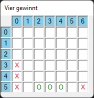

c# Programmieren (c) HTL-Leonding

# Vier Gewinnt

## Lehrziele

* mehrdimensionale Arrays
* Board

## Aufgabenstellung

**Vier-Gewinnt** ist ein bekanntes und beliebtest Spiel. Gespielt wird auf einem senkrecht stehenden Spielbrett. Bei jedem Zug kann ein **Stein** in eine Spalte eingeworfen werden. Dieser belegt dann das unterste freie Feld. Die zwei Spieler dürfen abwechselnd Steine auf dem Spielfeld plazieren. Gewinner ist derjenige, der als ersters vier Steine in einer Reihe, Spalte oder Diagonale hat.  

### Programmablauf
Schreiben Sie ein Programm mit dem **Vier-Gewinnt** gespiel werden kann.  
* Beim Programmstart wird die Dimension des Spielfelds eingegeben.  
  Unterstützen sie Größen von 2 bis 10 Reihen und Spalten.
* Anschließend wird das **Board** mit den eingegeneben Dimensionen erstellt.
* Zwei Benutzer können abwechselnd eine Spalte eingeben, in dem der nächste Stein eingeworfen werden soll.  
* Das Spiel ist beeendet, wenn ein Spieler gewonnen hat **oder** kein Stein mehr eingeworfen werden kann (das Spielfeld ist voll => unentschieden).
* Bei einer fehlerhaften Eingabe muss diese wiederholt werden: z.B. falsche Spalten/ZeilenAnzahlen, Spalte ist bereits voll, ... 

### Programmdesign

Achten Sie bei der Umsetzung auf ein sauberes Design Ihres Programms.  
In dem bereitgestellten Programm-Template sind Unittests vorhanden. Implementieren Sie die Methoden so, dass **alle** Unittests erfolgreich ausgeführt werden können. Änderungen an den *Unittests* sind nicht erlaubt.  
Damit die Unittests ausgeführt werden können müssen sie folgende (Hilfs-)Methoden umsetzen:

* `int GetFreeRow(int[,] allocation, int col)`  
Die Mehtodes sucht für die gegebene Spalte (col) die tiefste noch freie Zeile. -1 wird zurückgegeben, wenn keine Zeile mehr frei ist.   
* `int IsWinner(int[,] allocation, int row, int col)`  
Überprüft, ob sich durch die Belegung eines Feldes ein Sieger ergeben hat. Dabei werden nicht alle Felder überprüfen, sondern nur die an die neu gesetzte Position angrenzenden.  
Rückgabe: 0 falls kein Gewinner, sonst 1/2

Testen Sie das Programm ausführlich. 

### Bildschirmausgabe

```
Connect Four
============
Zeilen   [2..10]: 6
Spalten  [2..10]: 7
Spieler 1, Spalte  [0..6]: 0
Spieler 2, Spalte  [0..6]: 3
Spieler 1, Spalte  [0..6]: 0
Spieler 2, Spalte  [0..6]: 2
Spieler 1, Spalte  [0..6]: 0
Spieler 2, Spalte  [0..6]: 4
Spieler 1, Spalte  [0..6]: 6
Spieler 2, Spalte  [0..6]: 5
Gewinner ist Spieler 2!
```

