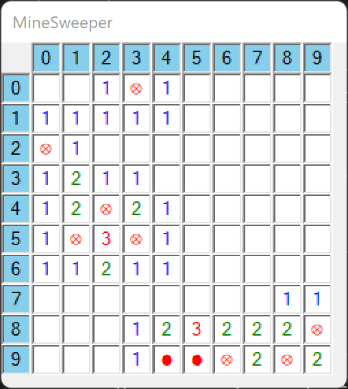

c# Programmieren (c) HTL-Leonding

# Mine Sweeper

## Lehrziele

* mehrdimensionale Arrays
* Board
* Schrittweise Verfeinerung
* Rekursion

## Aufgabenstellung

Der **MineSweeper** ist ein beliebtest Computerspiel. Es war bis zur Version von Windows 7 auf allen Microsoft Betriebssystemen installiert (siehe https://de.wikipedia.org/wiki/Minesweeper).
Ziel des Spieles ist es, auf einen virtuellen Minenfeld alle Minen zu markieren ohne sie auszulösen. Dabei werden vom Spieler Felder aufgedeckt. Der Computer prüft, ob es sich um eine Mine handelt (in diesem Fall ist das Spiel beendet) oder wie viele Minen in den angrenzenden Feldern vorhanden sind. Diese Anzahl wird dann in dem aufgedeckten Feld angezeigt. Der Spieler kann auch ein Feld als Mine markieren. Hat er die richtige Anzahl von Minen markiert und diese sind auch an der richtigen Position, ist das Spiel erfolgreich beendet.

### Programmablauf
Schreiben Sie ein Programm mit dem **MineSweeper** gespielt werden kann.  
* Beim Programmstart wird die Dimension des quadratischen Spielfelds eingegeben. 
  Unterstützen sie Größen von 2 bis 20 Reihen und Spalten.
* Der Benutzer muss angeben, wie viele Minen versteckt werden sollen.  
  Es soll mindestens eine und maximal "Spielfeldgröße" Minen versteckt werden.  
* Anschließend wird das **Board** mit den eingegebenen Dimensionen und den zufällig versteckten Minen erstellt.  
Alle Felder sind nicht sichtbar - Im Board werden sie mit dem UniCode-Zeichen "\u2593" initialisiert.
* Der Benutzer gibt anschließend Kommandos ein. Die Eingabe wird solange wiederholt bis das Spiel beendet ist.
* Nachdem alle Minen gefunden wurden oder der Benutzer ein Feld mit einer Mine aufgedeckt hat, wird eine  Übersicht des Minenfeldes angezeigt.

### Benutzer Eingaben

* Aufdecken eines Feldes  
  Mit der Eingabe von z.B. `4,7` wird das Feld in der Reihe 4 und Spalte 7 aufgedeckt.
  Handelt es sich um eine Mine, ist das Spiel beendet (Die noch nicht gefundenen Minen werden angezeigt).  
  Ist an dieser Stelle keine Mine, werden die umgebenen Minen gezählt. Bei einer Minenanzahl größer als 0 wird diese in das Feld geschrieben (achten sie auf die Farbe => 1:blau, 2:grün, 3:rot, ... ). Ist die Minenanzahl 0 werden die angrenzenden Felder rekursiv aufgedeckt.
* Markieren eines Feldes als Mine  
  Die Eingabe `*4,8` markiert ein Feld als Mine. Dabei wird **nicht** geprüft, ob tatsächlich hinter dem Feld eine Mine versteckt ist.
* Ende des Spiels mit `!`  
  Wenn der Benutzer alle Minen markiert hat, kann er mit `!` alle noch nicht aufgedeckte Felder aufdecken. Anschließen wird eine Übersicht angezeigt und das Spiel beendet.    

### Programmdesign

Achten Sie bei der Umsetzung auf ein sauberes Design Ihres Programms.  
Jede Benutzereingabe soll durch eine Methode umgesetzt werden. Kandidaten dafür könnten sine
* `ClearField`
* `MarkAsMine`
* `ClearAllFields`

Weitere Kandidaten für Methoden
* `InitBoard`  
  Initialisiert das Board. Dabei wird in alle Felder Unicode-Zeichen für "leeres Feld" geschrieben.
* `PlayGame`  
  Wiederholtes Lesen der Benutzereingabe und Ausführen des Kommandos.
* `ShowMines`  
  Am Ende des Spiels werden alle noch versteckten Minen angezeigt

### Unittest

In dem bereitgestellten Programm-Template sind Unittests vorhanden. Implementieren Sie die Methoden so, dass **alle** Unittests erfolgreich ausgeführt werden können. Änderungen an den *Unittests* sind nicht erlaubt.  
Damit die Unittests ausgeführt werden können müssen sie folgende (Hilfs-)Methoden umsetzen:

* `bool[,] CreateMineField(int countMines, int rows, int cols)`  
  Erstellt ein neues Minenfeld und versteckt darauf die angegebene Anzahl von Minen.
* `int CountMinesAround(bool[,] mineField, int row, int col)`  
  Die Mehtode berechnet an der gegebenen Reihe (row) und Spalte(col) die umgebenen Minen.
* `int CountMinesOnBoard(bool[,] mineField)`  
  Die Anzahl der am Minenfeld versteckten Minen wird gezählt.

Testen Sie das Programm ausführlich - die Unittests prüfen **nur** die oben angeführten Methoden! 

### Bildschirmausgabe

```
MineSweeper
===========
Size of (squared) board  [2..20]: 10
Count of mines  [1..100]: 10
Clear field with e.g.: 4,4
Set as mine with e.g.: *3,4
End game with !
=>4,4
=>7,4
=>*9,4
=>*9,5
=>!
Press enter to continue
```


